# DentalFlow

> **Where dental care flows effortlessly.**
> Built for **DentalHack 1.0 — Expedition 60**.

<p align="center">
  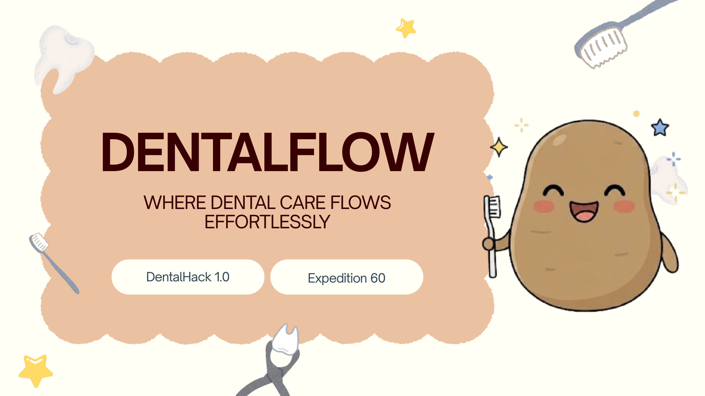
</p>

DentalFlow is a dual-platform, AI-assisted dental practice ecosystem that connects the **clinic side** (a Viewr-style admin panel for dentists) with the **patient side** (a mobile companion app), backed by a real-time synced database and a YOLO-based panoramic X-ray analysis pipeline.

---

## Table of Contents

- [The Problem](#the-problem)
- [Our Vision](#our-vision)
- [System Architecture](#system-architecture)
- [Dentist Side — Admin Dashboard](#dentist-side--admin-dashboard)
- [AI X-Ray Analysis Pipeline](#ai-x-ray-analysis-pipeline)
- [Stock & Supplier Automation](#stock--supplier-automation)
- [Patient Side — Beyond the Clinic](#patient-side--beyond-the-clinic)
- [Tech Stack](#tech-stack)
- [Repository Layout](#repository-layout)
- [Getting Started](#getting-started)
- [Slide Deck](#slide-deck)

---

## The Problem

Dental practice today is fragmented — clinics drown in admin work while patients drift away from their treatment plans the moment they leave the chair.

<table>
  <tr>
    <td width="50%">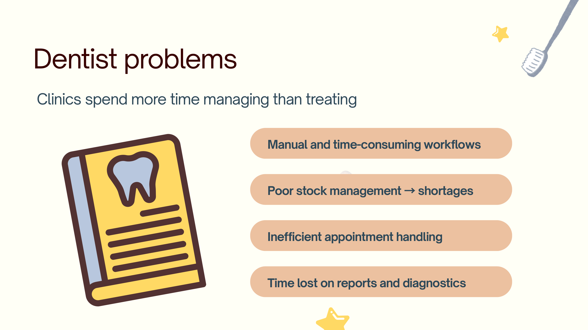</td>
    <td width="50%">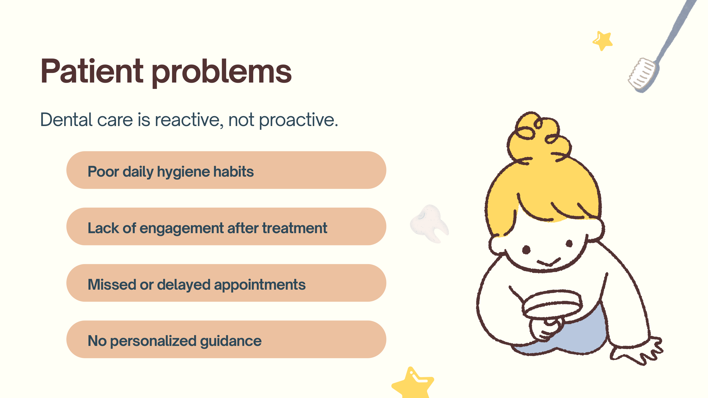</td>
  </tr>
  <tr>
    <td><b>Clinics spend more time managing than treating</b><br/>Manual workflows, stock shortages, missed appointments, and slow diagnostics.</td>
    <td><b>Dental care is reactive, not proactive</b><br/>Poor hygiene habits, no engagement after treatment, no personalized guidance.</td>
  </tr>
</table>

---

## Our Vision

A **dual-platform connected experience** — one centralized brain that serves both the dentist and the patient in real time.

<p align="center">
  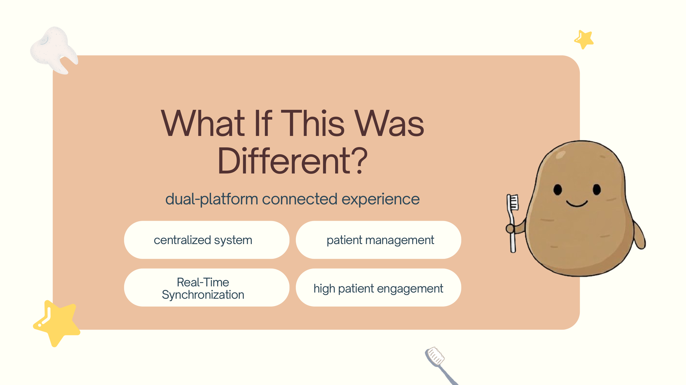
</p>

---

## System Architecture

The admin panel and the patient mobile app talk to a shared backend with a synced database, so what the dentist updates at the clinic instantly reaches the patient on their phone.

<p align="center">
  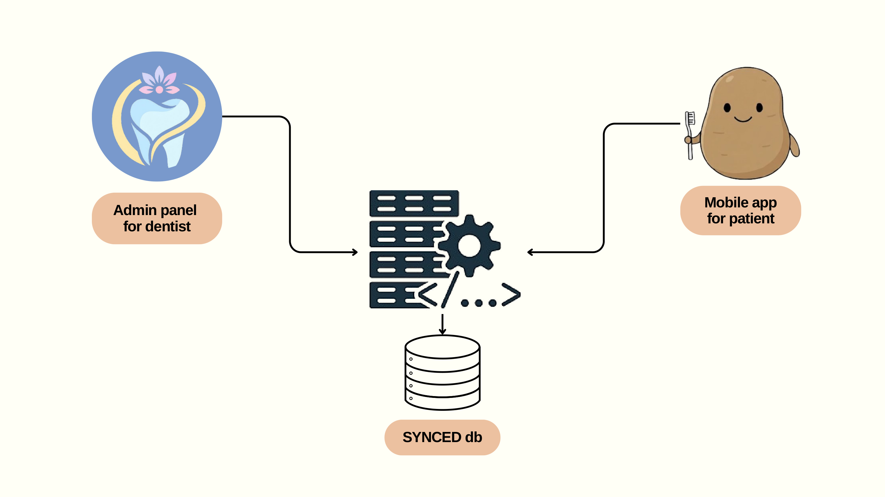
</p>

---

## Dentist Side — Admin Dashboard

<p align="center">
  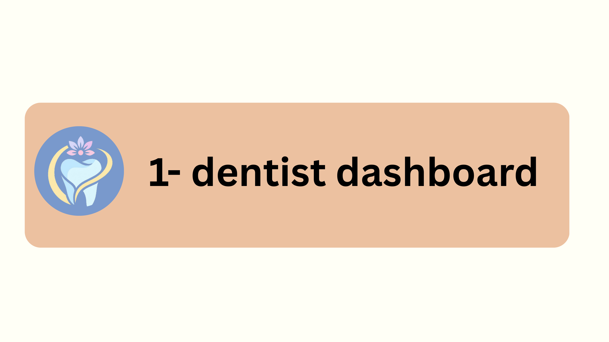
</p>

### Daily clinic pulse at a glance

The dashboard surfaces today's appointments, pending reports, total patient count, and low-stock alerts the moment the dentist logs in.

<p align="center">
  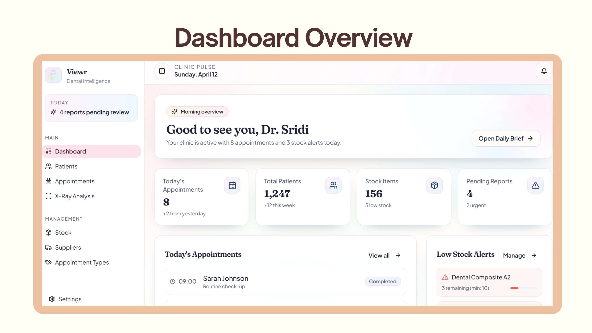
</p>

### Scheduling and patients

A calendar-based planner with quick previews, patient-focused time blocks, and a unified clinical calendar (week / month / today).

<p align="center">
  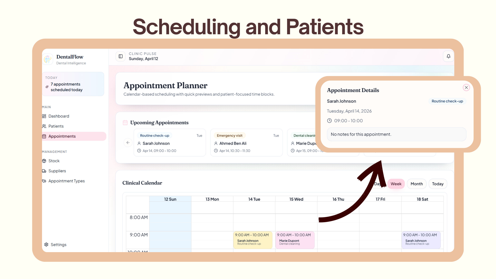
</p>

### Patient registry

Searchable patient registry with chart-linked medical history and a streamlined "new patient" flow.

<p align="center">
  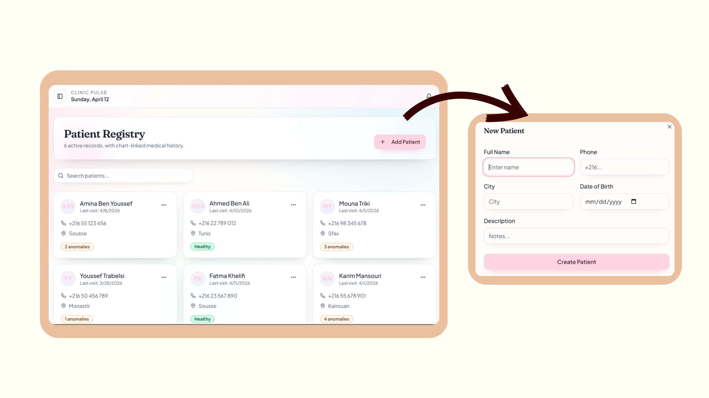
</p>

### Patient profile with interactive dental chart

Each patient has an interactive teeth diagram that color-codes findings (caries, bone loss, crowns, fillings, impacted teeth, etc.), plus a visit history and medical-files panel.

<p align="center">
  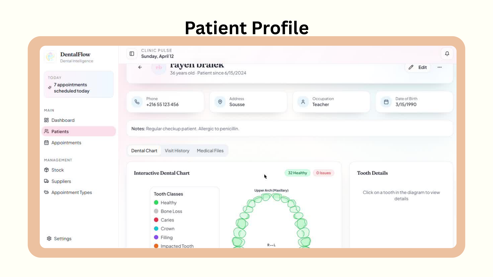
</p>

---

## AI X-Ray Analysis Pipeline

DentalFlow ships a custom **dual-YOLO segmentation pipeline** that turns a raw panoramic X-ray into a structured, FDI-numbered clinical report.

<p align="center">
  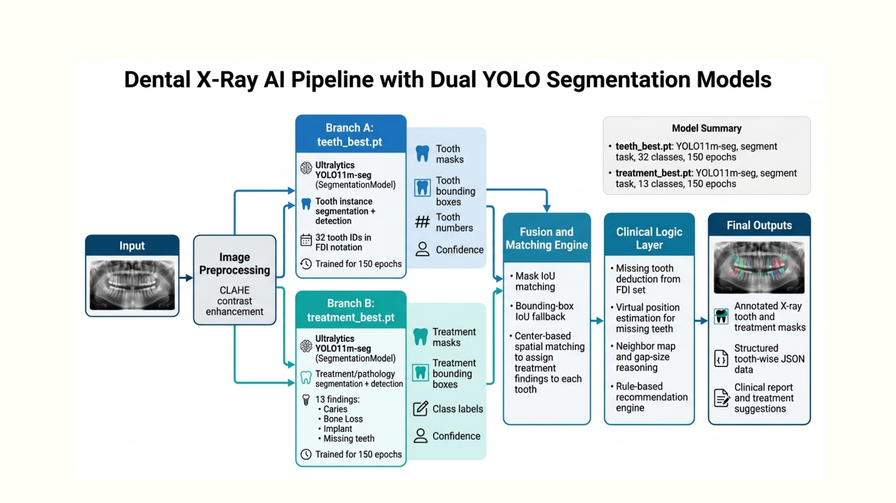
</p>

**Pipeline stages:**

1. **Image preprocessing** — CLAHE contrast enhancement.
2. **Branch A — `teeth_best.pt`** (YOLO11m-seg, 32 classes, tooth instance segmentation in FDI notation).
3. **Branch B — `treatment_best.pt`** (YOLO11m-seg, 13 classes — caries, crown, filling, implant, missing teeth, root canal, etc.).
4. **Fusion & matching engine** — mask IoU, bounding-box IoU fallback, and center-based spatial matching to assign findings to teeth.
5. **Clinical logic layer** — missing-tooth detection from FDI, neighbor-map and gap-size reasoning, rule-based recommendations.
6. **Final outputs** — annotated overlay, structured tooth-wise JSON, and a clinical report.

### Model performance

<table>
  <tr>
    <td>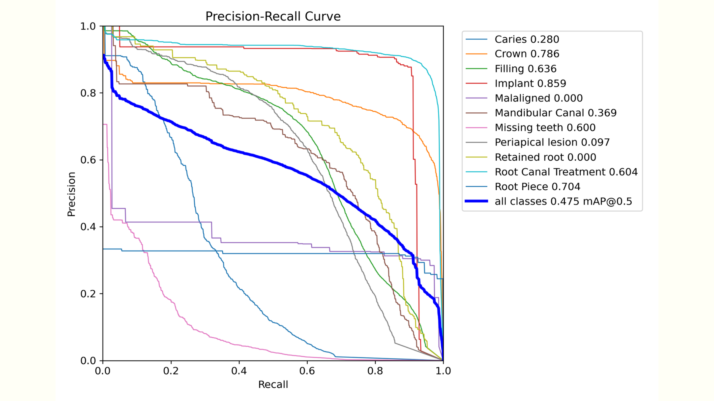</td>
    <td>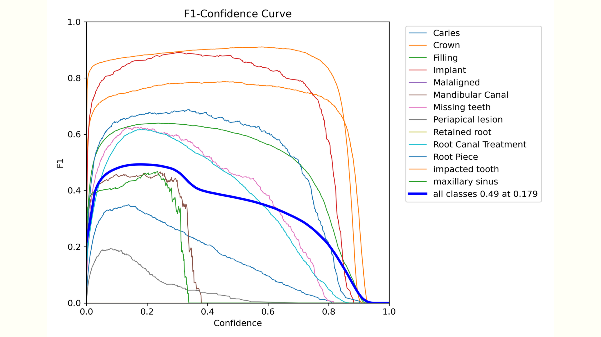</td>
  </tr>
  <tr>
    <td>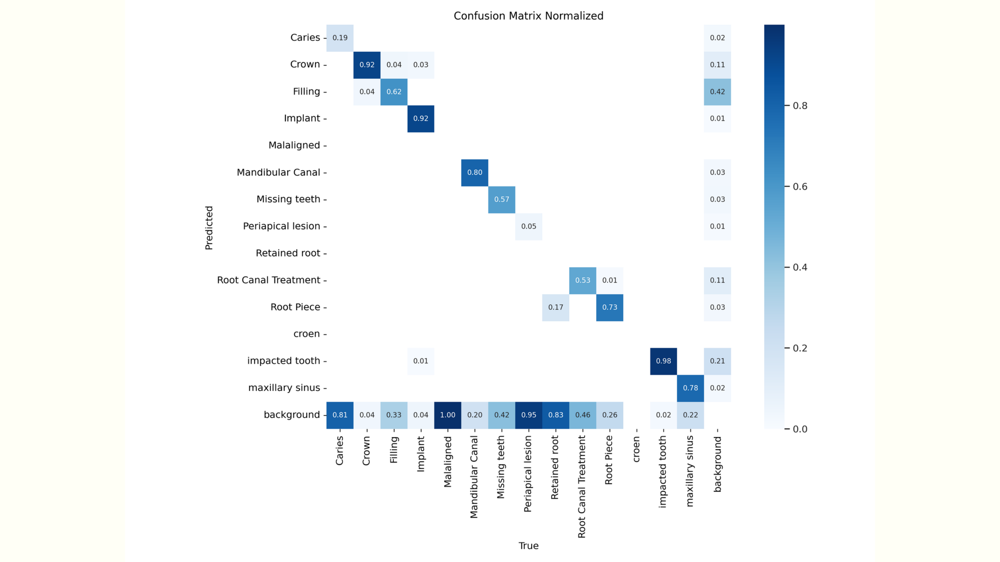</td>
    <td></td>
  </tr>
</table>

Per-class precision-recall, F1 vs. confidence, and a normalized confusion matrix across the 13 treatment classes — useful for spotting which findings (e.g. *caries*, *retained root*) need more training data.

### Before / after on a real panoramic X-ray

<table>
  <tr>
    <td width="50%">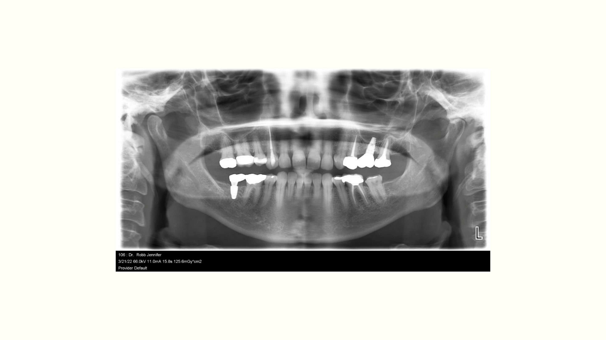</td>
    <td width="50%">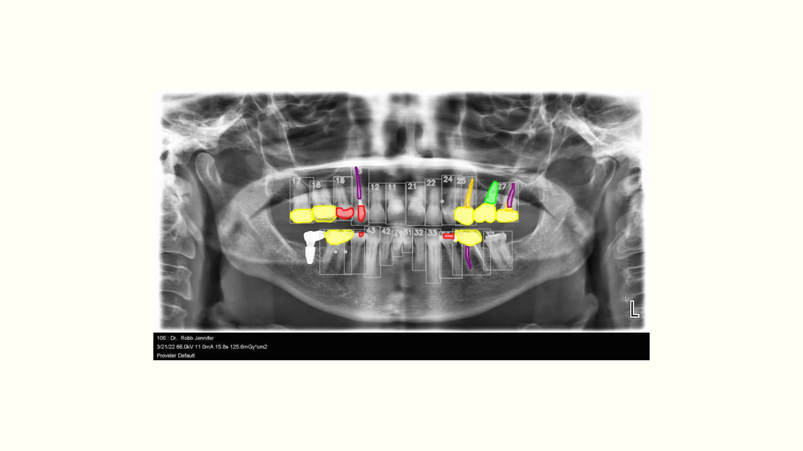</td>
  </tr>
  <tr>
    <td align="center"><b>Input</b><br/>Raw panoramic radiograph</td>
    <td align="center"><b>Output</b><br/>Tooth masks + treatment masks + FDI numbers</td>
  </tr>
</table>

---

## Stock & Supplier Automation

Inventory items, low-stock alerts, and expiration-risk tracking — plus per-appointment-type **supply necessities** so the dentist sees stock burn through automatically as appointments are booked.

<p align="center">
  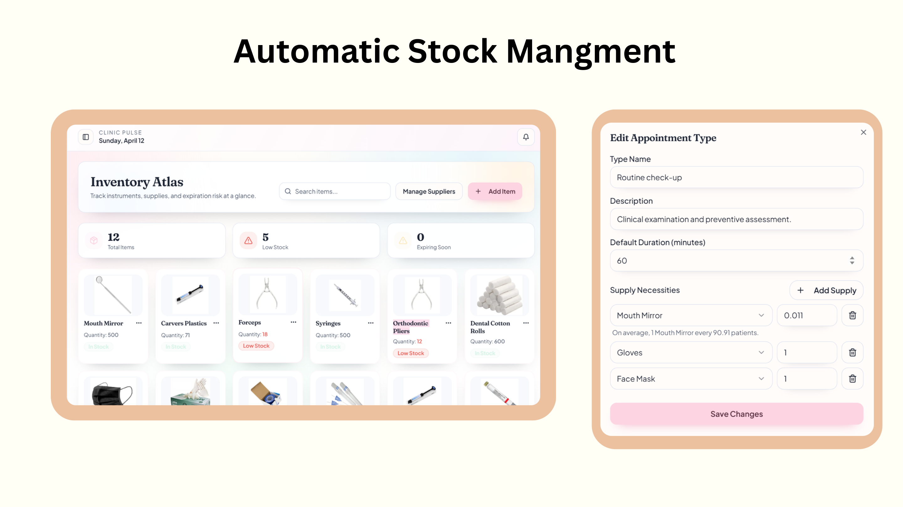
</p>

---

## Patient Side — Beyond the Clinic

<p align="center">
  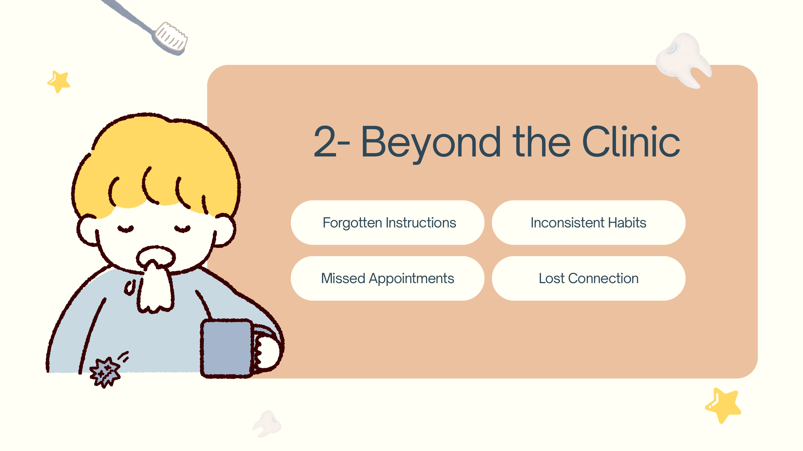
</p>

The companion mobile app keeps patients engaged after they leave the chair: daily hygiene reminders, post-treatment care tracking, photo-proof check-ins, and personalized guidance.

### 1. Smart, contextual notifications

<p align="center">
  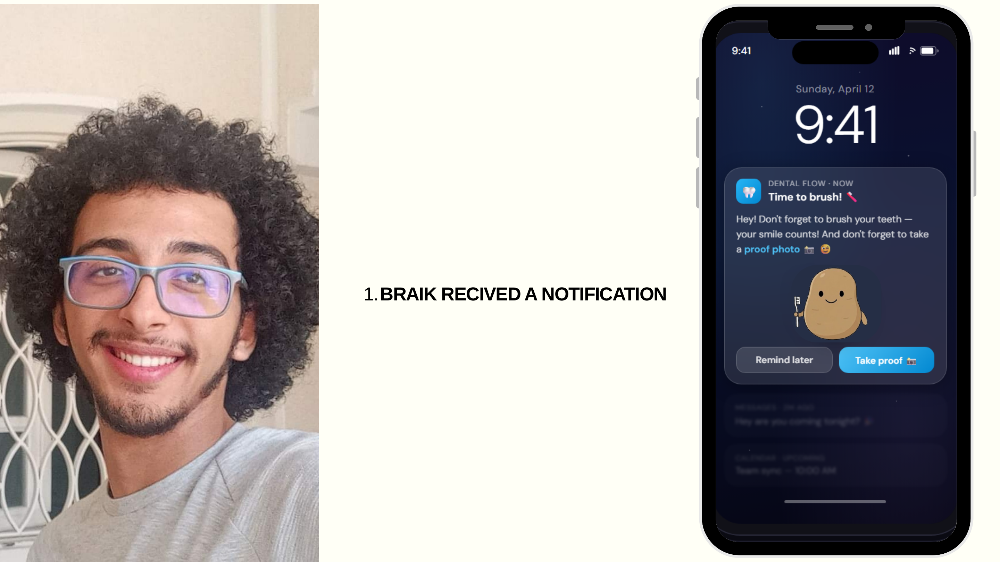
</p>

### 2. Companion home screen

Streak tracking, weekly score, post-treatment reminders, upcoming appointments, and quick actions (daily check, upload file).

<p align="center">
  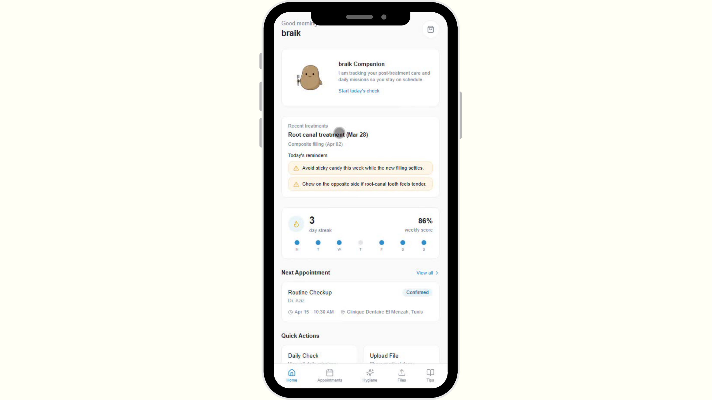
</p>

### 3. Interactive mascots — gamified hygiene

The longer a patient ignores their care plan, the unhappier their mascot gets. Streaks unlock new mascots — *Classic Buddy*, *Mug Buddy*, *GigaMaid*, *Ritchy Tooth* — paid for in earned coins.

<p align="center">
  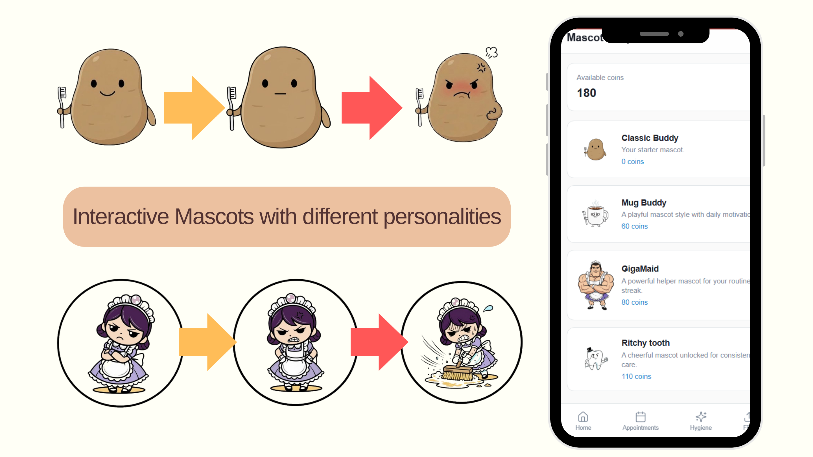
</p>

---

## Tech Stack

| Layer | Stack |
|---|---|
| **Web frontend** (dentist admin) | React 18, TypeScript, Vite, Tailwind CSS, shadcn/ui (Radix), React Router, TanStack Query, react-big-calendar, Recharts |
| **AI backend** | FastAPI, Gradio, Ultralytics YOLO11m-seg, OpenCV, NumPy, Albumentations |
| **AI models** | `teeth_best.pt` (32-class tooth instance segmentation, FDI notation) · `treatment_best.pt` (13-class anomaly/treatment segmentation) |
| **Patient app** | Mobile companion app (gamified hygiene + push notifications) |

---

## Repository Layout

```
dentairer-hack/
├── x-ray-vision-joy-main/    # React + Vite + Tailwind admin panel (dentist side)
│   ├── src/
│   │   ├── pages/            # Dashboard, Appointments, Patients, PatientProfile,
│   │   │                     # XRayAnalysis, Stock, Suppliers, AppointmentTypes, Login
│   │   ├── components/
│   │   ├── hooks/
│   │   └── lib/
│   └── package.json
│
├── ai-backend/               # FastAPI + Gradio inference service
│   ├── app.py                # DentalAnalyzer — dual-YOLO fusion pipeline
│   ├── api.py                # FastAPI /predict endpoint
│   ├── teeth_best.pt         # Tooth segmentation weights
│   ├── treatment_best.pt     # Treatment/anomaly segmentation weights
│   └── requirements.txt
│
├── images/
│   ├── presentation.pdf      # Pitch deck (source)
│   └── slides/               # PNG render of each deck page (slide-01.png … slide-22.png)
│
├── Rapport_Med_Aziz_Sridi.pdf
└── README.md
```

---

## Getting Started

### Prerequisites

- **Node.js 18+** (or **Bun**) for the frontend.
- **Python 3.10+** for the AI backend.
- The two YOLO weight files (`teeth_best.pt`, `treatment_best.pt`) placed in [ai-backend/](ai-backend/).

### 1. Run the dentist admin panel

```bash
cd x-ray-vision-joy-main
npm install        # or: bun install
npm run dev        # http://localhost:5173
```

Other scripts: `npm run build`, `npm run lint`, `npm test`.

### 2. Run the AI X-ray service

```bash
cd ai-backend
pip install -r requirements.txt

# FastAPI inference endpoint
uvicorn api:api --reload --port 8000

# Or the Gradio playground UI
python app.py
```

The FastAPI service exposes `POST /predict` ([ai-backend/api.py](ai-backend/api.py)) which accepts a panoramic X-ray and returns a JSON list of `{tooth_number, class}` findings.

<p align="center">
  
</p>
